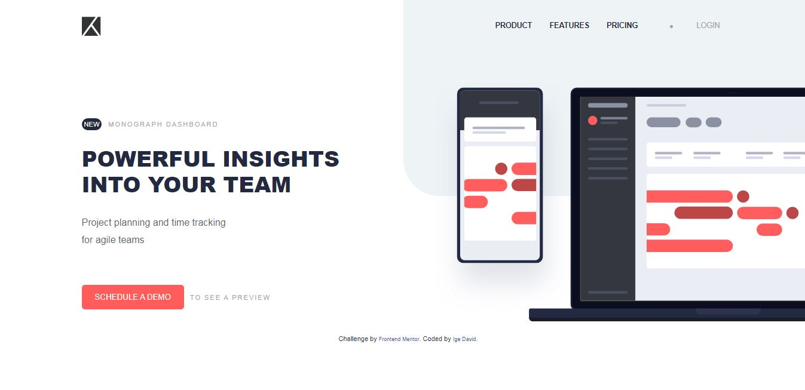
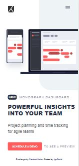

# Frontend Mentor - Project tracking intro component solution

This is a solution to the [Project tracking intro component challenge on Frontend Mentor](https://www.frontendmentor.io/challenges/project-tracking-intro-component-5d289097500fcb331a67d80e). Frontend Mentor challenges help you improve your coding skills by building realistic projects. 

## Table of contents

- [Overview]
  - [The challenge]
  - [Screenshot]
  - [Links]
- [My process]
  - [Built with]
- [Author]

## Overview

### The challenge

Users should be able to:

- View the optimal layout for the site depending on their device's screen size
- See hover states for all interactive elements on the page
- Create the background shape using code

### Screenshot
Desktop view

Mobile view

### Links

- Solution URL: (https://github.com/Defdave/project-tracking-intro-component-master)
- Live Site URL: (https://defdave.github.io/project-tracking-intro-component-master/)

### Built with

- Semantic HTML5 markup
- CSS
- Flexbox
- javascript

## Author

- Website - [Ige David]
- Frontend Mentor - [@Defdave](https://www.frontendmentor.io/profile/Defdave)
- Twitter - [@Expodominic](https://www.twitter.com/Expodominic)
